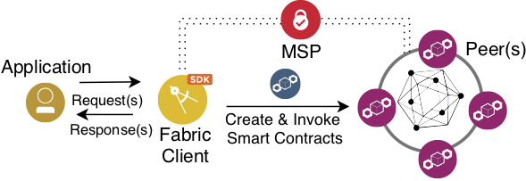

## Hyperledger Fabric - Network and Implementation for IoTLogBlock
The IoTLogBlock has the smart contract for the Hyperledger-Fabric

## File Structure
IoTLogBlock.go -> The smart contract which validates and resolves issues for the off-line transactions

enrollAdmin.js -> Nodejs script to install a register a fabric client to interact with the Fabric

invoke.js -> Send request(s) (example script) to the smart contract

query.js -> Query (example script) regarding the IoT devices that are registered to the smart contract  

tx_query.js -> Query (example script) regarding the IoT transactions to the smart contract

readserial.py -> Example of reading serial data and invoke the NodeJS examples

##

## Set-up the developing environment
Please follow the tutorial to build your first network [Building Your First Network](https://hyperledger-fabric.readthedocs.io/en/release-1.4/build_network.html).
Next, follow the [First applicaton](https://hyperledger-fabric.readthedocs.io/en/release-1.4/write_first_app.html) to get an understanding of how to write and run an application with Hypeledger-Fabric

You need to download the Docker images and restart them after a modify of the smart contract, an example script to do it: [Start](./RestartImages.sh)

The file [EnrollAdmin](./enrollAdmin.js) enroll an admin in the system, and it is necessary before calling any of the query NodeJS scripts. 

## Summary
In order to set-up the Hyperledger and make your modifications to the smart contract, you need to do the following:

1] Install the dependencies for the Fabric-samples

2] Follow the instructions to build your fist network

3] Rember to restart and overwrite the images every time you modify the smart contract see(./RestartImages.sh)
 

